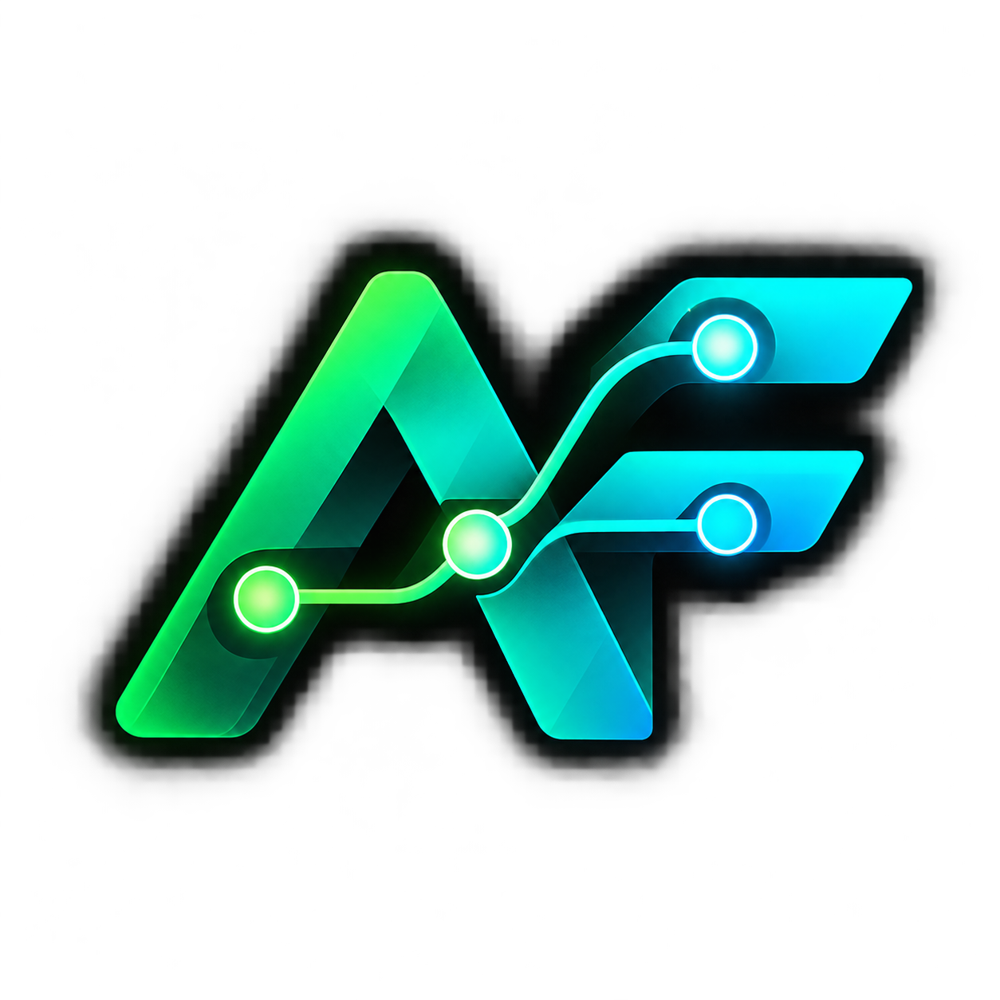
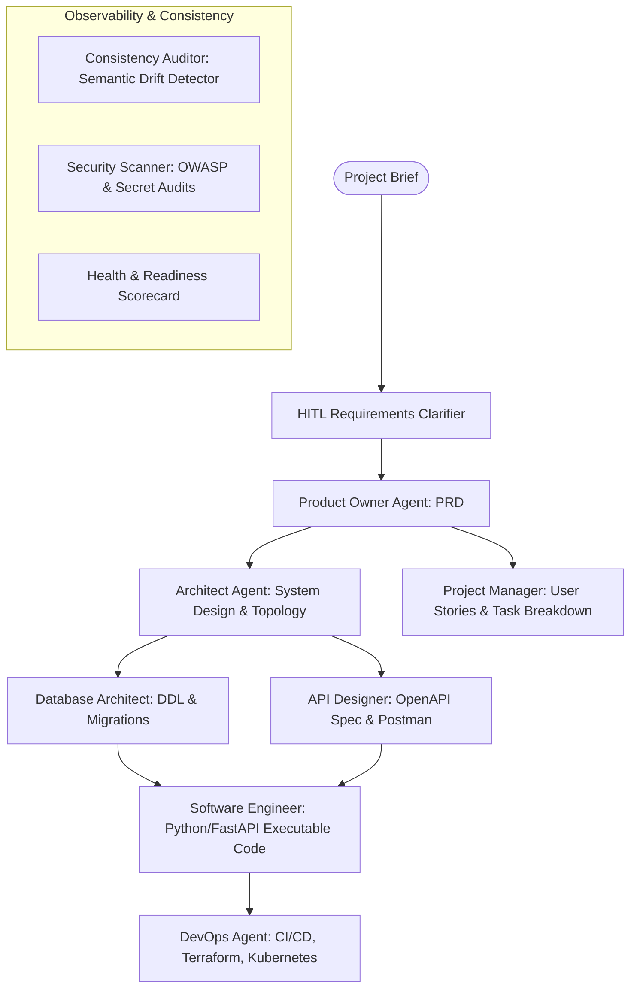

<p align="center">
  
</p>

# AgentFlow: Dependency-Aware Multi-Agent Framework for Deterministic Software Engineering

> **Autonomous 7-Agent DAG Fleet with Artifact-Specific Model Routing, Incremental Dependency Invalidation, and Pure-Code Executive Landscape Presentation Generation.**

---

## 📌 Overview

Modern software engineering teams still produce requirements, system architectures, database schemas, and API specifications through disconnected, manual authoring. A single upstream requirement shift frequently forces all downstream engineering documents to be manually recreated or leads to silent architectural drift.

**AgentFlow** models each generated engineering artifact — PRDs, Architecture Blueprints, Database DDLs, OpenAPI Specifications, User Stories, and Task Roadmaps — as a typed node in a directed acyclic dependency graph (DAG). 

- **Targeted Diff-Aware Invalidation**: When a requirement shifts, AgentFlow recomputes *only* the affected downstream artifacts rather than wastefully regenerating the entire pipeline.
- **Artifact-Specific Model Routing**: Dispatches each node to the optimal LLM provider (OpenAI GPT-4o, Anthropic Claude 3.5 Sonnet, or Ollama local models) based on benchmarked domain competencies.
- **Automated Consistency & Security Auditing**: Continually detects semantic drift across artifacts and gates deployment readiness.
- **Zero-AI Pure-Code Executive PDF Presentation Generator**: Compiles project health, database DDLs, API matrices, task roadmaps, and multi-cloud IaC into a landscape slide deck formatted in ReportLab without LLM hallucinations.

---

## 🏗️ Architecture & 7-Agent Fleet



---

## 📑 Pure-Code Landscape Presentation PDF Generator

AgentFlow features a deterministic, high-fidelity slide deck generation engine built on ReportLab:

- **Strict Landscape Format**: Rendered in Letter Landscape (`11 x 8.5 in` / `792 x 612 pt`), ready for executive walkthroughs and board pitches.
- **Zero AI / LLM Dependencies**: Generated entirely in pure code from live database records, OpenAPI route tables, and schema DDLs — ensuring 100% factual accuracy with zero hallucinations.
- **Cyber Dark Theme**: Styled with a `#0A0E1A` background, `#00FF66` neon highlights, `#00B8D9` cyan accents, and automatic two-pass slide numbering (`Slide X of Y`).
- **Standard 6-Slide Executive Deck**:
  1. **Title & Mission Slide**: Project name, brief, generation timestamp, and system metadata.
  2. **Executive Summary & Health Scorecard**: Real-time readiness gauge, artifact status breakdown, and drift indicators.
  3. **Architecture & Database Schema**: DDL summary, primary entities, and relational layout.
  4. **API Contracts Matrix**: REST endpoints, methods, response models, and security tags.
  5. **Task Roadmap & Milestones**: Prioritized user stories, estimated hours, and critical path.
  6. **Multi-Cloud IaC & Deployment**: Docker, Kubernetes, Terraform, and APM configurations.

### PDF Endpoints:
- `GET /projects/{project_id}/presentation-pdf` — Download attachment (`.pdf`).
- `GET /projects/{project_id}/preview-presentation-pdf` — Open inline preview in browser.

---

## 🐳 Docker Compose & Observability Infrastructure

AgentFlow includes an enterprise-ready multi-container stack orchestrated via Docker Compose:

| Service | Port | Description | Credentials / Default |
|---|---|---|---|
| **Backend API** | `8000` | FastAPI Multi-Agent Engine | [http://localhost:8000/docs](http://localhost:8000/docs) |
| **Dashboard UI** | `3000` | Next.js 16 Cyber Dashboard | [http://localhost:3000](http://localhost:3000) |
| **PostgreSQL** | `5432` | Relational Storage & Artifact Nodes | `postgres / postgres` |
| **Redis** | `6379` | Cache, Pub/Sub & Agent Queues | Default |
| **Adminer** | `8080` | Web-based Database Management GUI | [http://localhost:8080](http://localhost:8080) |
| **Prometheus** | `9090` | Time-Series Metrics & Latency Scraper | [http://localhost:9090](http://localhost:9090) |
| **Grafana** | `3001` | APM & Agent Observability Dashboards | `admin / admin` at [http://localhost:3001](http://localhost:3001) |
| **RabbitMQ** | `5672`, `15672` | Message Broker & Management Console | `agentflow / agentflow` at [http://localhost:15672](http://localhost:15672) |
| **OTel Collector** | `4317`, `4318` | OpenTelemetry Traces & Spans Ingestion | gRPC (`4317`), HTTP (`4318`) |
| **Ollama (Optional)** | `11434` | Offline Local LLM Execution | Profile: `offline-ai` |

### Starting the Infrastructure Stack:

```bash
# Start core application, database, and observability services
docker compose up -d

# Start with local offline AI engine (Ollama)
docker compose --profile offline-ai up -d
```

---

## 🚀 Quickstart (Local Development)

### ⚡ One-Click Auto Launch (Recommended)
You can start both the backend API and Next.js dashboard automatically with health checks and browser auto-opening:

- **Windows**: Double-click or run [`start.bat`](file:///H:/PROJECTS/Agents/AgentFlow/start.bat) (or `.\start.ps1`)
- **Cross-Platform / CLI**: Run `python start.py`

### 1. Backend Setup
```bash
cd backend
python -m venv venv
source venv/bin/activate  # On Windows: venv\Scripts\activate
pip install -r requirements.txt

# Run migrations and start API server
python -m uvicorn app.main:app --host 0.0.0.0 --port 8000 --reload
```

### 2. Dashboard Setup
```bash
cd dashboard
npm install
npm run dev
# Dashboard accessible at http://localhost:3000
```

### 3. Running Automated Tests
```bash
cd backend
python -m pytest -v
```

---

## 📄 License
MIT License. Built for autonomous deterministic software engineering.