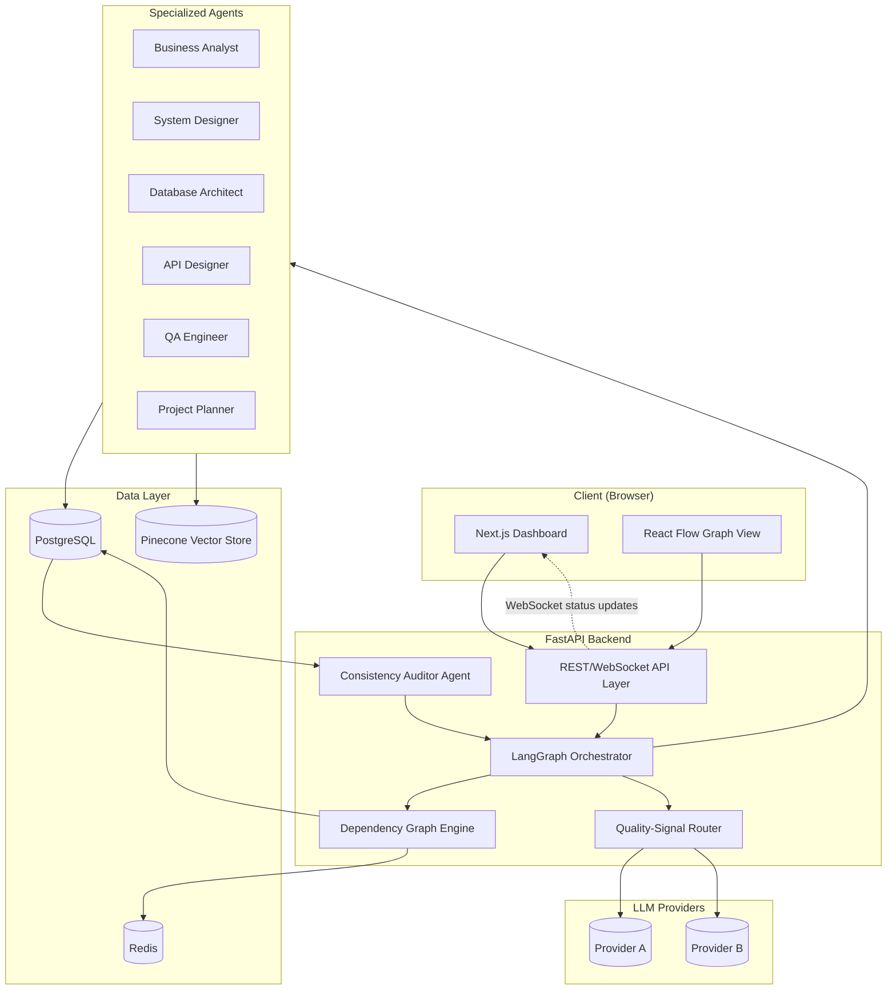
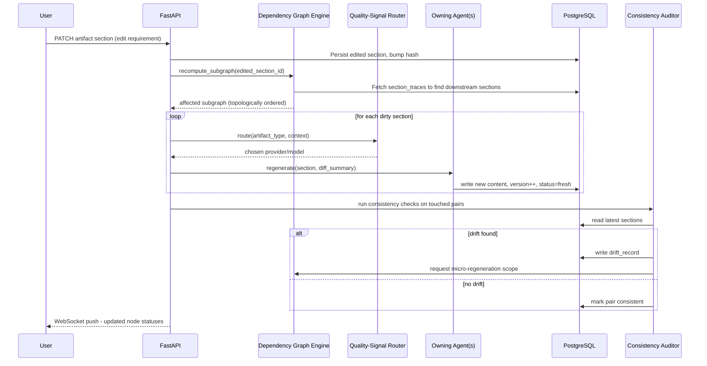

# Architecture Document
## AgentFlow — Dependency-Aware Selective Regeneration for Multi-Agent Software Engineering Artifact Generation

| | |
|---|---|
| **Author** | M Harish Gautham |
| **Document Type** | Architecture Document |
| **Version** | 1.0 |
| **Status** | Draft |

---

## 1. Overview

This document specifies the technical architecture implementing the design described in `design.md`: the full-stack platform, service boundaries, data schema, API contracts, deployment topology, and cross-cutting concerns (security, scalability, observability) required to build AgentFlow.

---

## 2. Tech Stack

| Layer | Technology | Purpose |
|---|---|---|
| Frontend | Next.js (React), React Flow | Dashboard, dependency graph visualization |
| Backend API | FastAPI (Python) | REST/WebSocket API, orchestration entry point |
| Multi-Agent Orchestration | LangGraph | Agent graph execution, state management, conditional routing |
| Relational Store | PostgreSQL (SQLAlchemy + Pydantic) | Projects, artifacts, sections, versions, drift/generation logs |
| Cache | Redis | Job queue state, routing-decision cache, session/dashboard live-state |
| Vector Store | Pinecone | Semantic context retrieval across artifact sections (for prompting and traceability inference) |
| LLM Providers | Multi-provider (e.g., Anthropic, OpenAI) via abstracted provider layer | Artifact generation, routed per artifact type |
| Auth | OAuth2 / JWT (via FastAPI) | User authentication for dashboard/API |
| Containerization | Docker / Docker Compose | Local dev + deployment packaging |

---

## 3. High-Level Architecture Diagram



---

## 4. Component Breakdown

### 4.1 Frontend — Next.js + React Flow
- Server-rendered dashboard app. Fetches project/artifact state via REST, subscribes to a WebSocket channel for live regeneration/drift status updates.
- React Flow renders the dependency graph; node click opens the Artifact Panel (fetches section content + diff).
- State is fetched from the backend on demand; no client-side persistence of source-of-truth data (backend/Postgres is authoritative).

### 4.2 Backend — FastAPI
- Exposes REST endpoints for project/artifact CRUD, regeneration triggers, drift management, and metrics.
- Exposes a WebSocket endpoint for pushing live status (`regenerating`, `fresh`, `drifted`) to connected dashboard clients.
- Hosts the **LangGraph Orchestrator**, which wires the six agents, the Dependency Graph Engine, the Quality-Signal Router, and the Consistency Auditor Agent into a single executable graph per project run.

### 4.3 Multi-Agent Orchestration — LangGraph
- Each of the six agents (Business Analyst, System Designer, Database Architect, API Designer, QA Engineer, Project Planner) is a LangGraph node with typed input/output state.
- The **Dependency Graph Engine** determines, per triggering event (new brief, section edit, drift fix), which agent nodes should execute and in what order (topological order of the affected subgraph).
- The **Quality-Signal Router** is invoked by the orchestrator immediately before each agent node executes, to select the concrete LLM call target for that node's invocation.
- The **Consistency Auditor Agent** is a separate LangGraph subgraph triggered after any generation batch completes, and on a periodic schedule.

### 4.4 Data Layer
- **PostgreSQL** is the system of record: projects, artifact nodes, sections, versions, drift records, generation logs, routing decisions.
- **Redis** caches: (a) in-flight job/regeneration state for fast dashboard polling/WebSocket push, (b) recent routing-decision quality scores for the router's `historical_scores` lookups, (c) rate-limit counters per LLM provider.
- **Pinecone** stores embeddings of artifact sections to support semantic retrieval of relevant upstream context during generation and to assist the traceability-inference step when linking a new downstream section back to the upstream section(s) that most influenced it.

### 4.5 LLM Provider Abstraction
- A thin provider-abstraction layer normalizes calls across providers (request/response shape, token accounting, error handling) so the router can treat providers interchangeably and new providers can be added by implementing a single interface.

---

## 5. API Design (REST Endpoints)

| Method | Endpoint | Description |
|---|---|---|
| `POST` | `/projects` | Create a project from a brief; triggers initial full-pipeline generation |
| `GET` | `/projects/{id}` | Fetch project metadata and artifact graph summary |
| `GET` | `/projects/{id}/graph` | Fetch full dependency graph (nodes, sections, statuses, edges) |
| `GET` | `/projects/{id}/artifacts/{artifact_type}` | Fetch full content of a given artifact |
| `PATCH` | `/projects/{id}/artifacts/{artifact_type}/sections/{section_id}` | Edit a section; triggers diff-aware subgraph recomputation |
| `POST` | `/projects/{id}/regenerate` | Manually trigger regeneration of a specific node/section |
| `GET` | `/projects/{id}/drift` | List open/resolved drift records |
| `POST` | `/projects/{id}/drift/{drift_id}/resolve` | Trigger auto-fix (micro-regeneration) or dismiss a drift record |
| `GET` | `/projects/{id}/metrics` | Cost, latency, quality-signal metrics for the project |
| `POST` | `/eval/run` | Kick off an evaluation harness run across a batch of briefs vs. baselines |
| `GET` | `/eval/{run_id}/results` | Fetch evaluation results (cost, latency, quality, drift %, regeneration efficiency) |
| `WS` | `/ws/projects/{id}` | Live status updates (node status changes, drift events) |

---

## 6. Database Schema (PostgreSQL)

```sql
CREATE TABLE projects (
    id UUID PRIMARY KEY,
    name TEXT NOT NULL,
    brief TEXT NOT NULL,
    created_at TIMESTAMPTZ DEFAULT now()
);

CREATE TABLE artifact_nodes (
    id UUID PRIMARY KEY,
    project_id UUID REFERENCES projects(id),
    artifact_type TEXT NOT NULL CHECK (
        artifact_type IN ('PRD','SDD','DB_SCHEMA','API_SPEC','USER_STORIES','TASKS')
    ),
    version INT NOT NULL DEFAULT 1,
    status TEXT NOT NULL DEFAULT 'fresh'
        CHECK (status IN ('fresh','stale','regenerating','drifted')),
    quality_signal_score FLOAT,
    generated_by_model TEXT,
    updated_at TIMESTAMPTZ DEFAULT now()
);

CREATE TABLE artifact_sections (
    id UUID PRIMARY KEY,
    artifact_node_id UUID REFERENCES artifact_nodes(id),
    section_key TEXT NOT NULL,
    content TEXT NOT NULL,
    content_hash TEXT NOT NULL,
    updated_at TIMESTAMPTZ DEFAULT now()
);

CREATE TABLE section_traces (
    downstream_section_id UUID REFERENCES artifact_sections(id),
    upstream_section_id UUID REFERENCES artifact_sections(id),
    PRIMARY KEY (downstream_section_id, upstream_section_id)
);

CREATE TABLE drift_records (
    id UUID PRIMARY KEY,
    project_id UUID REFERENCES projects(id),
    check_name TEXT NOT NULL,
    artifact_a UUID REFERENCES artifact_nodes(id),
    artifact_b UUID REFERENCES artifact_nodes(id),
    section_a UUID REFERENCES artifact_sections(id),
    section_b UUID REFERENCES artifact_sections(id),
    description TEXT NOT NULL,
    status TEXT NOT NULL DEFAULT 'open'
        CHECK (status IN ('open','auto_fixed','dismissed')),
    detected_at TIMESTAMPTZ DEFAULT now(),
    resolved_at TIMESTAMPTZ
);

CREATE TABLE generation_logs (
    id UUID PRIMARY KEY,
    project_id UUID REFERENCES projects(id),
    artifact_node_id UUID REFERENCES artifact_nodes(id),
    triggered_by TEXT NOT NULL
        CHECK (triggered_by IN ('initial_generation','selective_regeneration','micro_regeneration')),
    provider TEXT NOT NULL,
    model TEXT NOT NULL,
    predicted_quality_signal FLOAT,
    tokens_used INT,
    cost_usd NUMERIC(10,4),
    latency_ms INT,
    created_at TIMESTAMPTZ DEFAULT now()
);

CREATE TABLE eval_runs (
    id UUID PRIMARY KEY,
    label TEXT NOT NULL,          -- 'agentflow' | 'single_llm_baseline' | 'multiagent_no_dep_baseline'
    brief_count INT,
    started_at TIMESTAMPTZ DEFAULT now(),
    completed_at TIMESTAMPTZ
);

CREATE TABLE eval_results (
    id UUID PRIMARY KEY,
    eval_run_id UUID REFERENCES eval_runs(id),
    project_id UUID REFERENCES projects(id),
    total_cost_usd NUMERIC(10,4),
    total_latency_ms INT,
    quality_score FLOAT,
    drift_percentage FLOAT,
    regeneration_efficiency FLOAT   -- nodes regenerated / total nodes, on an edit scenario
);
```

---

## 7. Data Flow — Mid-Project Edit Scenario



---

## 8. Deployment Architecture

- **Local Development:** `docker-compose` spinning up `frontend`, `backend`, `postgres`, `redis`; Pinecone and LLM providers accessed as external managed services via environment-configured API keys.
- **Staging/Production:** Containerized services deployed behind a reverse proxy (e.g., Nginx/Traefik); FastAPI backend horizontally scalable behind a load balancer; PostgreSQL and Redis run as managed services (e.g., RDS/ElastiCache-equivalent) for durability.
- **CI/CD:** On merge to main — run unit/integration tests, build Docker images, push to registry, deploy to staging; evaluation harness runs as a scheduled/triggered job separate from the request-serving path (to avoid impacting user-facing latency).
- **Environments:** `dev`, `staging`, `prod`, each with isolated Postgres/Redis instances and separate LLM-provider rate-limit budgets.

---

## 9. Scalability Considerations

- **Stateless backend workers:** FastAPI + LangGraph orchestration is designed to be stateless per request, with all durable state in Postgres/Redis, allowing horizontal scaling of backend instances.
- **Async agent execution:** Independent subgraph branches (e.g., regenerating User Stories and Task Breakdown after an API Spec change) can be executed concurrently since LangGraph supports parallel node execution where there is no data dependency.
- **Provider rate limiting:** Redis-backed token-bucket rate limiting per LLM provider to avoid throttling; router treats rate-limited providers as temporarily unavailable and reroutes.
- **Vector store scaling:** Pinecone indexes are namespaced per project to bound query scope and keep retrieval latency low as the number of projects grows.

## 10. Security Considerations

- All LLM provider API keys and database credentials are stored server-side (never exposed to the Next.js client) and injected via environment/secret manager.
- Dashboard authentication via OAuth2/JWT; all REST/WebSocket endpoints require a valid session token scoped to the requesting user's projects.
- Input briefs and artifact content are treated as untrusted text; no generated content is executed — the system only produces documentation artifacts, not executable code, limiting injection risk to prompt-level concerns, which are mitigated via structured output parsing (Pydantic schema validation on every agent output).

## 11. Observability & Monitoring

- Every LLM call is logged in `generation_logs` with provider, model, tokens, cost, and latency — feeding both the dashboard metrics panel and the evaluation harness.
- Structured logging (request id, project id, artifact node id) across the FastAPI layer for tracing a regeneration event end-to-end.
- Dashboard "Metrics Panel" surfaces per-project cost/latency/quality trends and, in evaluation mode, side-by-side comparison against baseline runs stored in `eval_runs` / `eval_results`.

## 12. Evaluation Harness Architecture

- A separate `eval` module drives three pipeline configurations against the same 15–20 project briefs:
  1. **AgentFlow** (full system: graph + router + auditor).
  2. **Single-LLM baseline** (one fixed model generates all six artifacts sequentially, full regeneration on any edit).
  3. **Multi-agent, no dependency tracking** (six specialized agents, but full-pipeline regeneration on any edit, no router, no auditor).
- Each configuration runs an identical **scripted mid-project edit** per brief to measure regeneration efficiency and drift under a controlled scenario.
- Results are persisted to `eval_runs`/`eval_results` and rendered in the dashboard for side-by-side comparison, satisfying the evaluation plan defined in `prd.md`.
