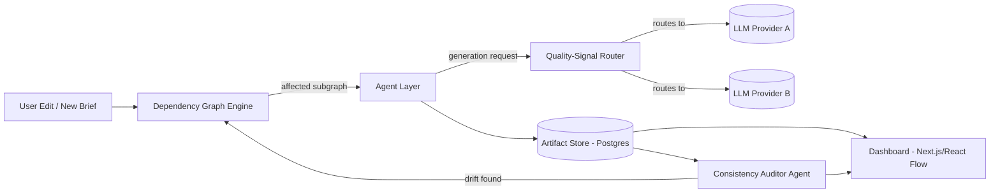
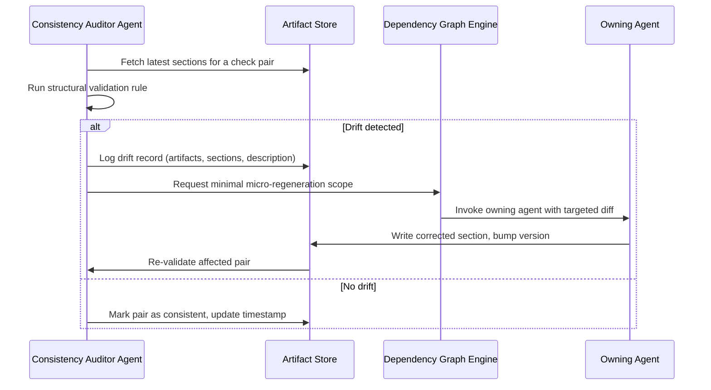

# Software Design Document (SDD)
## AgentFlow — Dependency-Aware Selective Regeneration for Multi-Agent Software Engineering Artifact Generation

| | |
|---|---|
| **Author** | M Harish Gautham |
| **Document Type** | Software Design Document |
| **Version** | 1.0 |
| **Status** | Draft |

---

## 1. Introduction

This document describes the internal design of AgentFlow: how the multi-agent pipeline is structured, how the typed dependency graph and selective regeneration engine work, how the quality-signal router makes model-selection decisions, how the Consistency Auditor Agent detects and repairs drift, and how the dashboard visualizes system state. It is the direct downstream artifact of `prd.md` and upstream of `architecture.md`.

---

## 2. System Overview

AgentFlow consists of five cooperating subsystems:

1. **Agent Layer** — Six specialized LLM-backed agents, one per artifact type, orchestrated via LangGraph.
2. **Dependency Graph Engine** — Maintains the typed graph of artifacts, computes diffs, and determines the minimal regeneration subgraph on each edit.
3. **Quality-Signal Decision Engine** — Scores artifact-type-specific structural signals and routes each generation call to the most suitable LLM provider.
4. **Consistency Auditor Agent** — Continuously validates cross-artifact structural consistency and triggers micro-regeneration on drift.
5. **Dashboard** — Next.js + React Flow client for visualizing the graph, artifact state, and metrics.



---

## 3. Agent Roles & Responsibilities

| Agent | Produces | Reads (dependencies) | Core Responsibility |
|---|---|---|---|
| **Business Analyst** | PRD | Project brief | Extract goals, requirements, user personas, scope from raw brief |
| **System Designer** | SDD | PRD | Translate requirements into system components, modules, data flow |
| **Database Architect** | Database Schema | SDD | Derive entities, relationships, referential integrity constraints |
| **API Designer** | API Specification | SDD + Database Schema | Derive endpoints, request/response contracts, mapped to schema fields |
| **QA Engineer** (User Stories) | User Stories | PRD + API Specification | Derive testable user-facing stories traceable to requirements |
| **Project Planner** | Task Breakdown | User Stories + API Specification | Decompose stories into actionable engineering tasks |

Each agent is implemented as a LangGraph node with:
- A **typed input contract** (Pydantic model of its upstream dependencies).
- A **typed output contract** (Pydantic model of the artifact it produces).
- A **prompt template** parameterized by the current artifact content and the identified diff (for regeneration) or full context (for first generation).

---

## 4. Typed Dependency Graph Design

### 4.1 Graph Schema

The dependency graph is fixed at the **type level** (six artifact types, five directed edges) but instantiated per project with **node-level granularity** below the artifact-type level — each artifact is further decomposed into addressable **sections** (e.g., a PRD has requirement sections; a Database Schema has per-table sections) so that regeneration can be scoped below "regenerate the whole document."

```
PRD ──▶ SDD ──▶ DatabaseSchema ──▶ APISpec ──┬─▶ UserStories ──▶ TaskBreakdown
                                              │
                       PRD ─────────────────┘   (API Spec + PRD → User Stories)
```

Node record:
```python
class ArtifactNode(BaseModel):
    id: UUID
    project_id: UUID
    artifact_type: Literal["PRD", "SDD", "DB_SCHEMA", "API_SPEC", "USER_STORIES", "TASKS"]
    sections: list[ArtifactSection]
    version: int
    status: Literal["fresh", "stale", "regenerating", "drifted"]
    quality_signal_score: float | None
    generated_by_model: str | None
    updated_at: datetime

class ArtifactSection(BaseModel):
    id: UUID
    section_key: str          # e.g. "requirement:auth-flow", "table:users"
    content: str
    content_hash: str         # used for diffing
    traces_to: list[UUID]     # upstream section ids this section was derived from
```

Edges carry a **traceability map**: each downstream section stores which upstream section(s) it was derived from (`traces_to`), which is what makes fine-grained diffing possible.

### 4.2 Diff-Aware Subgraph Recomputation Algorithm

1. On edit to section `S` in node `N`, recompute `content_hash(S)`.
2. If the hash changed, mark `S` **dirty** and look up all sections in downstream artifact types whose `traces_to` includes `S.id`.
3. Recursively propagate dirtiness forward through the graph (BFS), building the **affected subgraph** `G_affected`.
4. Nodes/sections *not* reachable from `S` in `G_affected` are left untouched — their version and status remain unchanged.
5. For each dirty section (in topological order), invoke the owning agent with:
   - The dirty section's new content.
   - The prior content of the section it is regenerating (for continuity).
   - A **diff summary** (what changed upstream) rather than the full upstream document, to minimize prompt size.
6. After regeneration, recompute `traces_to` links and `content_hash` for the newly generated sections, and mark them `fresh`.
7. Bump `version` on every touched node; store the prior version for rollback.

```python
def recompute_subgraph(edited_section_id: UUID) -> set[UUID]:
    dirty = {edited_section_id}
    frontier = [edited_section_id]
    while frontier:
        current = frontier.pop()
        downstream = find_sections_tracing_to(current)
        for sec in downstream:
            if sec.id not in dirty:
                dirty.add(sec.id)
                frontier.append(sec.id)
    return dirty  # topologically ordered before regeneration
```

This is the mechanism that gives AgentFlow its core novelty over MetaGPT/ChatDev-style full-pipeline regeneration, and extends beyond ALMAS/Meta-RAG's code-only AST scope into upstream documentation artifacts.

---

## 5. Artifact-Type-Specific Quality-Signal Router

### 5.1 Quality Signals per Artifact Type

| Artifact Type | Structural Quality Signal | Computation |
|---|---|---|
| PRD | Requirement-traceability coverage | % of extracted requirements that are later referenced by a `traces_to` link in any downstream artifact |
| SDD | Component-coverage completeness | % of PRD requirements mapped to at least one SDD component |
| Database Schema | Referential integrity score | % of foreign keys resolving to existing tables/columns; normalization checks |
| API Specification | Endpoint/method contract completeness | % of endpoints with fully specified request/response schemas mapped to DB fields |
| User Stories | Requirement traceability | % of user stories linked back to a PRD requirement |
| Task Breakdown | Story coverage | % of user stories decomposed into at least one task with acceptance criteria |

### 5.2 Decision Engine

```python
class RoutingDecision(BaseModel):
    artifact_type: str
    chosen_provider: str
    chosen_model: str
    predicted_quality_signal: float
    estimated_cost_usd: float
    rationale: str

def route(artifact_type: str, context_size: int, historical_scores: dict) -> RoutingDecision:
    candidates = PROVIDER_REGISTRY.models_for(artifact_type)
    scored = [
        (m, score_candidate(m, artifact_type, historical_scores))
        for m in candidates
    ]
    best = max(scored, key=lambda pair: pair[1].quality_per_dollar)
    return RoutingDecision(...)
```

- `score_candidate` combines: (a) the model's **historical quality-signal performance** on this artifact type (tracked per provider over past generations in this project and across the evaluation corpus), and (b) **cost per token** for that provider, to produce a quality-per-dollar ranking.
- Routing decisions and resulting quality-signal scores are logged (`RoutingDecision` + measured post-hoc signal) to continuously improve `historical_scores`.
- The router is designed to be provider-agnostic: adding a new LLM provider only requires registering it in `PROVIDER_REGISTRY` with its cost table.

---

## 6. Consistency Auditor Agent

### 6.1 Validation Rules

The Auditor runs a fixed set of **cross-artifact structural checks**, each scoped to a pair of artifact types:

| Check | Artifacts Compared | Drift Example |
|---|---|---|
| Requirement coverage | PRD ↔ SDD | A PRD requirement has no corresponding SDD component |
| Schema-endpoint mapping | Database Schema ↔ API Specification | An API endpoint references a field that doesn't exist in the schema |
| Endpoint-requirement mapping | API Specification ↔ PRD | An API endpoint has no PRD requirement justifying it (or vice versa) |
| Story traceability | User Stories ↔ PRD | A user story doesn't trace to any requirement |
| Task coverage | Task Breakdown ↔ User Stories | A user story has zero associated tasks |

### 6.2 Drift Detection & Micro-Regeneration Flow



- The Auditor runs automatically after every regeneration event (event-driven) and additionally on a periodic sweep (configurable interval) to catch drift from manual edits.
- Drift records are surfaced on the dashboard with severity and one-click "auto-fix" (trigger micro-regeneration) or "dismiss" (human override).
- Micro-regeneration is scoped to the **smallest necessary section**, not the whole artifact, keeping the auditor's fixes cheap and structurally consistent with the selective-regeneration philosophy of the graph engine.

---

## 7. Data Models (Core Pydantic Schemas)

```python
class Project(BaseModel):
    id: UUID
    name: str
    brief: str
    created_at: datetime

class DriftRecord(BaseModel):
    id: UUID
    project_id: UUID
    check_name: str
    artifact_a: UUID
    artifact_b: UUID
    section_a: UUID | None
    section_b: UUID | None
    description: str
    status: Literal["open", "auto_fixed", "dismissed"]
    detected_at: datetime
    resolved_at: datetime | None

class GenerationLog(BaseModel):
    id: UUID
    project_id: UUID
    artifact_node_id: UUID
    triggered_by: Literal["initial_generation", "selective_regeneration", "micro_regeneration"]
    routing_decision: RoutingDecision
    tokens_used: int
    cost_usd: float
    latency_ms: int
    created_at: datetime
```

---

## 8. UI / UX Design

**Dashboard (Next.js + React Flow):**
- **Graph View** — Nodes = artifact types (and expandable to section-level), colored by status (`fresh` = green, `stale` = amber, `regenerating` = blue/pulsing, `drifted` = red). Edges show dependency direction and highlight the "affected subgraph" during an active regeneration.
- **Artifact Panel** — Side panel showing the full content of a selected artifact/section, with inline diff view against the previous version.
- **Drift Panel** — List of open `DriftRecord`s with severity, affected artifacts, and "Auto-fix" / "Dismiss" actions.
- **Metrics Panel** — Per-project and per-artifact cost, latency, and quality-signal charts; comparison toggle against baseline runs (for the evaluation harness use case).
- **Brief Intake** — A simple form to submit a new project brief and kick off initial full-pipeline generation.

---

## 9. Error Handling & Edge Cases

| Case | Handling |
|---|---|
| Upstream artifact edited while downstream regeneration is in flight | Regeneration job is versioned against the source hash it started from; if the source changed mid-flight, the job is invalidated and re-queued against the latest hash |
| LLM provider failure/timeout during routing | Router falls back to the next-best-ranked candidate provider; failure logged in `GenerationLog` |
| Circular traceability (should not occur given fixed graph topology) | Graph engine validates topological order at startup; rejects any manually inserted edge that would create a cycle |
| Auditor false positive | Human can "Dismiss" a drift record from the dashboard; dismissal is logged and excluded from future identical checks until content changes again |
| Section deleted upstream | Downstream sections tracing to it are marked `drifted` rather than silently deleted, requiring explicit human or Auditor-triggered resolution |
